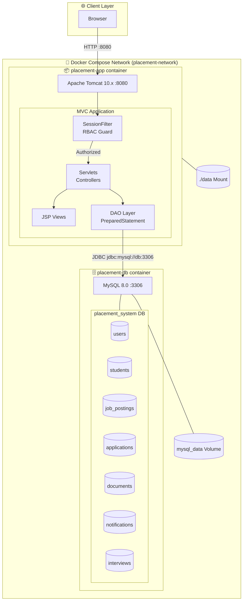
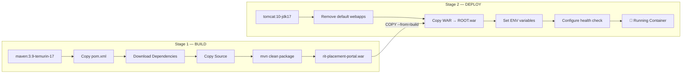
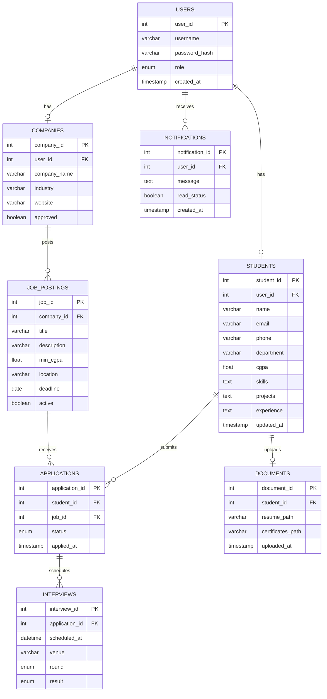
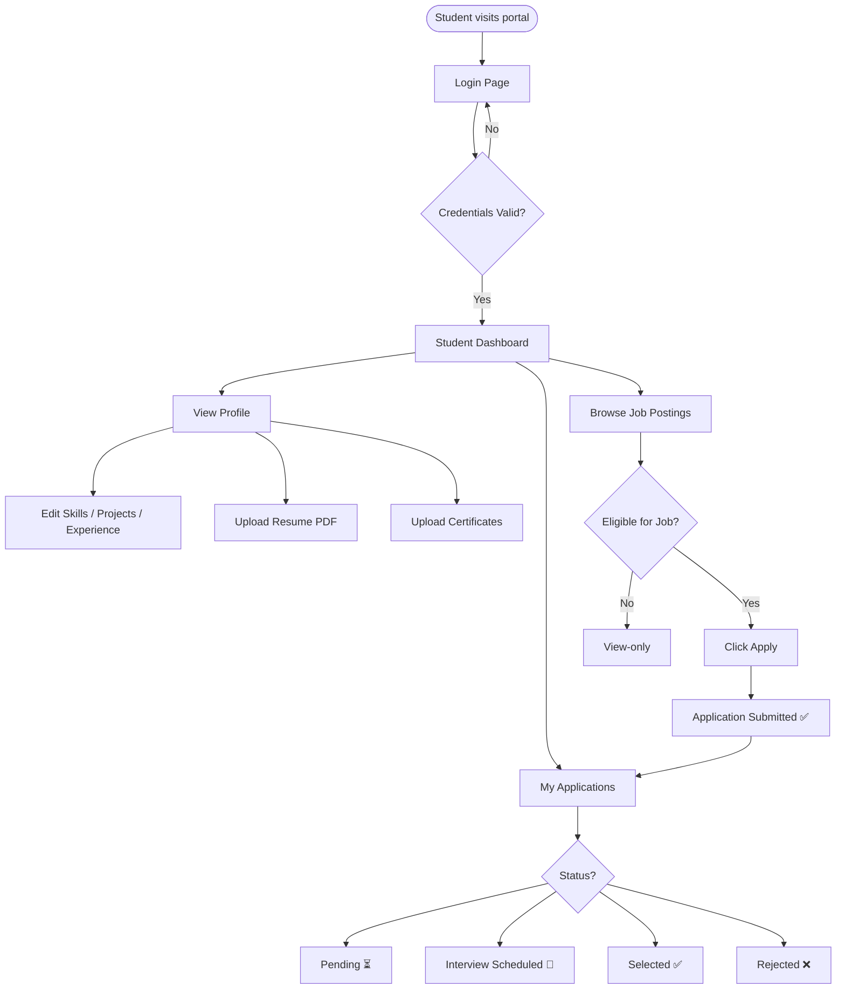
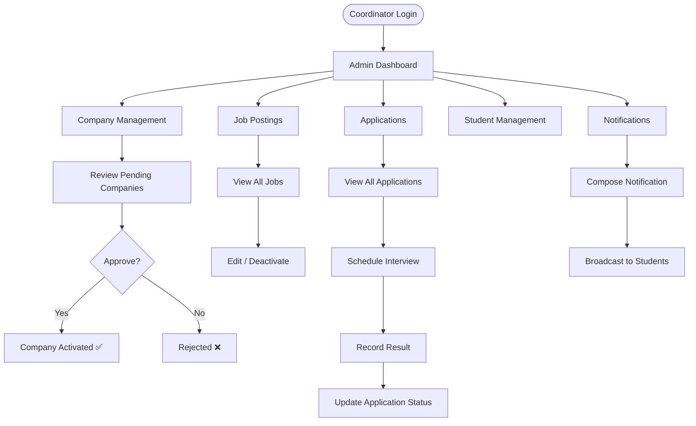
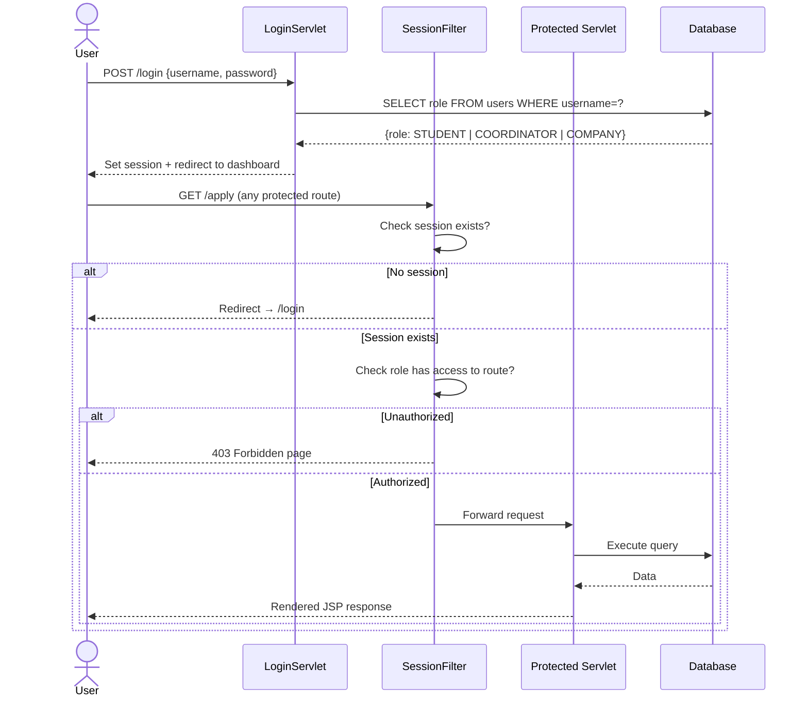
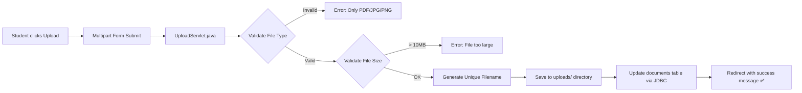

<div align="center">

# 🎓 CampusToCareer
### *Enterprise-Grade College Placement Portal*

[](https://openjdk.org/)
[](https://tomcat.apache.org/)
[](https://www.mysql.com/)
[](https://docs.docker.com/compose/)
[](https://maven.apache.org/)
[](LICENSE)

**A full-stack placement management system bridging students, companies, and placement coordinators — built with Java Servlets, JSP, MySQL, and Docker.**

[Features](#-features) • [Architecture](#-architecture) • [Getting Started](#-getting-started) • [Database Schema](#-database-schema) • [User Flows](#-user-flows) • [Deployment](#-deployment)

</div>

---

## 📌 Table of Contents

- [Problem Statement](#-problem-statement)
- [Features](#-features)
- [Tech Stack](#-tech-stack)
- [Architecture](#-architecture)
- [Database Schema](#-database-schema)
- [User Flows](#-user-flows)
- [Role-Based Access Control](#-role-based-access-control)
- [Screenshots](#-screenshots)
- [Getting Started](#-getting-started)
- [Docker Deployment](#-docker-deployment)
- [Project Structure](#-project-structure)
- [Security](#-security)
- [Future Enhancements](#-future-enhancements)

---

## 🧩 Problem Statement

Campus placement processes are traditionally fragmented — students apply via email, coordinators manage spreadsheets, and companies lack a unified view of eligible candidates. **CampusToCareer** eliminates this friction by providing a single, role-aware platform where:

- 🎓 **Students** manage profiles, upload documents, and track applications
- 🏢 **Companies** post job openings and view eligible candidates
- 🛡️ **Coordinators** oversee the entire placement pipeline end-to-end

---

## ✨ Features

### 👨‍🎓 Student Portal
| Feature | Description |
|---|---|
| Profile Management | Update skills, projects, experience, and academic info |
| Document Upload | Upload resume (PDF) and certificates (PDF/JPG/PNG) with validation |
| Job Discovery | Browse all active job postings with company details |
| One-Click Apply | Apply to eligible job postings instantly |
| Application Tracker | Monitor status of all submitted applications |

### 🏢 Company Portal
| Feature | Description |
|---|---|
| Job Posting | Create and manage job listings with eligibility criteria |
| Candidate View | View list of eligible and applied students |
| Company Profile | Manage company information and branding |

### 🛡️ Coordinator (Admin) Portal
| Feature | Description |
|---|---|
| Company Management | Approve, edit, and manage company registrations |
| Job Oversight | Full CRUD on all job postings across companies |
| Application Pipeline | View and manage all applications system-wide |
| Student Management | View and manage student profiles and eligibility |
| Placement Reports | Comprehensive placement activity dashboard |
| Notification System | Broadcast notifications to students |
| Interview Scheduling | Schedule and track interview rounds |

### 🔒 System-Wide
| Feature | Description |
|---|---|
| Role-Based Access Control | Fine-grained route protection via `SessionFilter` |
| Custom Error Pages | User-friendly 403/500 error pages (no stack traces) |
| Docker Deployment | One-command spin-up with `docker compose up --build` |
| Dockerized MySQL | Persistent volumes, health checks, auto-initialization |

---

## 🛠️ Tech Stack

```
Frontend   →  JSP (JavaServer Pages) + CSS
Backend    →  Java Servlets (MVC pattern) + Apache Tomcat 10.x
Database   →  MySQL 8.0
Build      →  Apache Maven 3.9
Container  →  Docker + Docker Compose (multi-stage build)
JDK        →  OpenJDK 17
```

---

## 🏗️ Architecture

### System Architecture



### Multi-Stage Docker Build



---

## 🗄️ Database Schema



---

## 🔄 User Flows

### Student — Full Journey



### Coordinator — Placement Pipeline



### Authentication & RBAC Flow



### Document Upload Flow



---

## 🔑 Role-Based Access Control

| Route | 🎓 Student | 🛡️ Coordinator | 🏢 Company |
|---|:---:|:---:|:---:|
| `/student/dashboard` | ✅ Full | ❌ | ❌ |
| `/student/profile` | ✅ Full | ❌ | ❌ |
| `/apply` | ✅ Full | ❌ | ❌ |
| `/my-applications` | ✅ Full | ❌ | ❌ |
| `/companies` | 👁️ Read-only | ✅ Full | ❌ |
| `/job-postings` | 👁️ Read-only | ✅ Full | ❌ |
| `/eligible-students` | 👁️ Read-only | ✅ Full | ❌ |
| `/admin/*` | ❌ | ✅ Full | ❌ |
| `/company/*` | ❌ | ❌ | ✅ Full |
| `/upload` | ✅ Full | ❌ | ❌ |

> All routes are guarded by `SessionFilter.java` which intercepts every request before it reaches any servlet.

---

## 🖼️ Screenshots

> **Note:** Below are representative descriptions of each view. Screenshots can be added by replacing the placeholders with actual images from your running instance.

### Login Page
```
┌─────────────────────────────────────┐
│        🎓 CampusToCareer            │
│     RIT ISE Placement Portal        │
│                                     │
│  Username: [________________]       │
│  Password: [________________]       │
│                                     │
│         [ Login ]                   │
└─────────────────────────────────────┘
```
*Clean login page with role-aware redirection — students land on student dashboard, coordinators on admin panel.*

### Student Dashboard
- Profile summary with CGPA, skills, experience
- Active job listings filtered by eligibility
- Application status tracker with color-coded badges

### Admin Dashboard
- KPI cards: Total Students, Active Jobs, Pending Applications, Companies
- Quick actions: Approve Companies, Review Applications
- Full data tables with edit/delete/approve actions

### Document Upload (Profile Page)
- Drag-and-drop resume upload
- Certificate upload with file type and size validation
- Uploaded document viewer with download links

---

## 🚀 Getting Started

### Prerequisites

```bash
# Option A: Local (Manual)
Java 17+          # java -version
Maven 3.9+        # mvn -version
MySQL 8.0+        # mysql --version
Tomcat 10.x       # catalina.sh version

# Option B: Docker (Recommended — zero setup)
Docker 24+        # docker --version
Docker Compose    # docker compose version
```

### Option A — Local Setup

**1. Clone the repository**
```bash
git clone https://github.com/AnanthAkshay/CampusToCareer.git
cd CampusToCareer
```

**2. Set up the database**
```bash
mysql -u root -p < sql/docker-init.sql
mysql -u root -p placement_system < APPLY_FIXES.sql
mysql -u root -p placement_system < sql/fix_students_table.sql
mysql -u root -p placement_system < sql/create_documents_table.sql
```

**3. Configure environment**
```bash
cp .env.example .env
# Edit .env with your MySQL credentials and SMTP settings
```

**4. Create uploads directory**
```bash
mkdir -p src/main/webapp/uploads
```

**5. Build and deploy**
```bash
mvn clean package
cp target/rit-placement-portal.war $CATALINA_HOME/webapps/ROOT.war
$CATALINA_HOME/bin/startup.sh
```

**6. Access the portal**
```
http://localhost:8080
Login: ADMIN001 / admin123
```

---

## 🐳 Docker Deployment

> **Recommended** — spins up the full stack in one command with no manual DB setup.

```bash
# Clone
git clone https://github.com/AnanthAkshay/CampusToCareer.git
cd CampusToCareer

# Configure environment
cp .env.example .env

# Build and start everything
docker compose up --build -d

# Access at
http://localhost:8080
```

### Docker Architecture at a Glance

```
Host Machine
│
├── Docker Compose (placement-network)
│   │
│   ├── placement-app  [Tomcat 10 + JDK 17]
│   │     Port: 8080:8080
│   │     Volume: ./data:/app/data
│   │     Depends on: placement-db (healthy)
│   │
│   └── placement-db   [MySQL 8.0]
│         Port: 3306:3306
│         Volume: mysql_data (persistent)
│         Init: sql/docker-init.sql
│
└── External: http://localhost:8080
```

### Useful Docker Commands

```bash
# Start
docker compose up --build -d

# Stop
docker compose down

# View logs
docker compose logs -f

# Check status
docker compose ps

# Full reset (removes data)
docker compose down -v

# Rebuild only app
docker compose up --build app -d
```

---

## 📁 Project Structure

```
CampusToCareer/
│
├── src/
│   └── main/
│       ├── java/com/rit/placement/
│       │   ├── controller/          # Servlets (Controllers)
│       │   │   ├── LoginServlet.java
│       │   │   ├── ProfileServlet.java
│       │   │   ├── UploadServlet.java
│       │   │   ├── ApplicationServlet.java
│       │   │   └── ...
│       │   ├── dao/                 # Data Access Objects
│       │   │   ├── StudentDAO.java
│       │   │   ├── DocumentDAO.java
│       │   │   ├── JobPostingDAO.java
│       │   │   └── ...
│       │   ├── model/               # POJOs / Domain Models
│       │   │   ├── Student.java
│       │   │   ├── Document.java
│       │   │   ├── JobPosting.java
│       │   │   └── ...
│       │   ├── filter/
│       │   │   └── SessionFilter.java   # RBAC Guard
│       │   └── util/
│       │       └── DBConnection.java    # JDBC Connection Pool
│       │
│       └── webapp/
│           ├── pages/
│           │   ├── student/         # Student JSP views
│           │   ├── admin/           # Coordinator JSP views
│           │   ├── company/         # Company JSP views
│           │   └── error/           # 403.jsp, 500.jsp
│           ├── css/                 # Stylesheets
│           ├── uploads/             # Document storage (gitignored)
│           └── WEB-INF/
│               └── web.xml
│
├── sql/
│   ├── docker-init.sql              # Full schema + seed data
│   ├── fix_students_table.sql       # Patch: add missing columns
│   └── create_documents_table.sql   # Documents module schema
│
├── data/                            # Mounted volume for uploads
├── Dockerfile                       # Multi-stage build
├── docker-compose.yml
├── .env.example
├── pom.xml
└── README.md
```

---

## 🔒 Security

| Concern | Implementation |
|---|---|
| SQL Injection | `PreparedStatement` used across all DAO classes |
| XSS | Input sanitization at servlet layer |
| CSRF | Session-based validation on state-changing endpoints |
| Authentication | Session-based with secure logout |
| Authorization | `SessionFilter` enforces RBAC on every request |
| File Upload | Type whitelist (PDF/JPG/PNG) + 10MB size cap |
| Path Traversal | Unique filename generation via UUID |
| Error Leakage | Custom 403/500 pages — zero stack traces exposed |

---

## 🌐 Environment Variables

| Variable | Description | Example |
|---|---|---|
| `DB_HOST` | Database hostname | `db` (Docker) / `localhost` |
| `DB_PORT` | MySQL port | `3306` |
| `DB_NAME` | Database name | `placement_system` |
| `DB_USER` | Database user | `root` |
| `DB_PASSWORD` | Database password | `your_password` |
| `SMTP_USERNAME` | Email sender address | `noreply@ritplacement.edu` |
| `SMTP_PASSWORD` | App password for SMTP | `xxxx xxxx xxxx xxxx` |
| `SMTP_FROM_EMAIL` | From address in emails | `noreply@ritplacement.edu` |

---

## 🧪 Test Credentials

| Role | Username | Password |
|---|---|---|
| Coordinator (Admin) | `ADMIN001` | `admin123` |
| Student | *(Register via admin panel)* | — |
| Company | *(Registered + approved by admin)* | — |

---

## 🔮 Future Enhancements

- [ ] AI-powered eligibility matching (recommend jobs to students by skill gap)
- [ ] Email/SMS notifications for interview scheduling
- [ ] Document versioning and expiry tracking
- [ ] Bulk CSV import for student onboarding
- [ ] Placement analytics dashboard with charts
- [ ] Resume preview (PDF viewer in-browser)
- [ ] REST API layer for mobile app integration
- [ ] OAuth2 login (Google Workspace SSO for college accounts)

---

## 👤 Author

**Ananth Akshay**
B.E. Computer Science, MS Ramaiah Institute of Technology, Bengaluru

[](https://github.com/AnanthAkshay)

---

## 📄 License

This project is licensed under the MIT License — see the [LICENSE](LICENSE) file for details.

---

<div align="center">

*Built with ❤️ for the MS RIT ISE Department*

**⭐ Star this repo if it helped you!**

</div>
