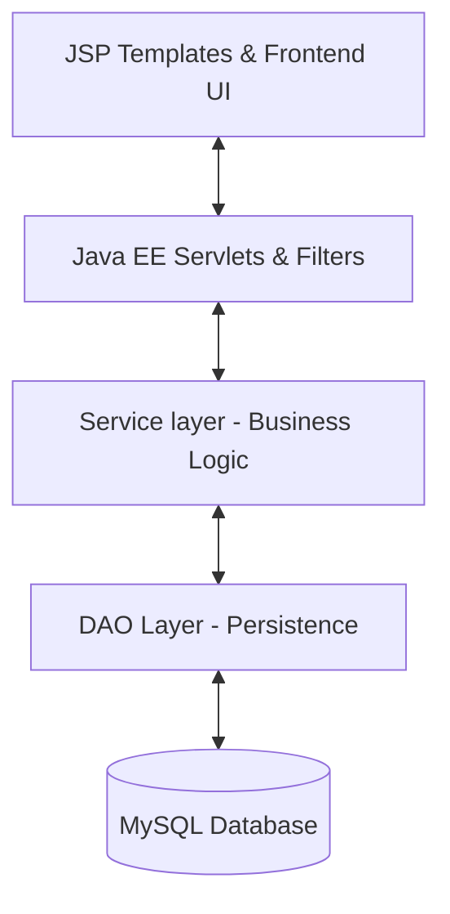

# 🎯 RIT Placement Portal — Architecture & Design Guide

Welcome to the **RIT Placement Portal** repository. This document provides a high-level overview of the application architecture, technology stack, and engineering practices implemented within the project to ensure performance, security, and scalability.

---

## 🏛️ System Architecture

The RIT Placement Portal is built following the robust **MVC (Model-View-Controller)** architectural pattern using **Java EE** Servlets and **JSP (JavaServer Pages)**, backed by a relational **MySQL** database.

### 1. Presentation Layer (View)
*   **JSP (JavaServer Pages)**: Dynamic web templates styled with harmony-tailored modern Vanilla CSS.
*   **Decoupled View Logic**: Presentation labels, colors, and layout variables are calculated directly within the templates or using helper systems, keeping model classes completely clean and free of UI styling logic.

### 2. Controller & Security Layer
*   **Java Servlets**: Handles incoming HTTP GET/POST requests, invokes the business logic layers, and routes the response.
*   **Session Filter (`SessionFilter.java`)**: Implements strict role-based access control and session management for students, proctors, companies, and administrators.
*   **Rate Limiting & Security Guard**: Built-in protection against brute-force attacks on sensitive endpoints (e.g. OTP validation) using IP-based and USN-based cooldown windows.

### 3. Business Service Layer
*   **Candidate Ranking Service (`CandidateRankingService.java`)**: Implements candidate prioritization algorithms.
*   **Job Recommendation Service (`JobRecommendationService.java`)**: Recommends best-fitting jobs to students based on dynamic criteria (CGPA, skills, branch match).
*   **Eligibility Engine (`EligibilityService.java`)**: Evaluates multi-criterion eligibility rules for applications.

### 4. Data Access Layer (Model & DAO)
*   **Data Transfer Objects (DTOs)**: Simple, clean model classes (e.g., `EligibilityResult.java`, `User.java`, `Student.java`, `JobPosting.java`) decoupled from implementation details.
*   **DAO Classes**: Pure SQL execution using `PreparedStatement` and safe connection pooling via HikariCP. Fully guarantees resources are wrapped in **try-with-resources** blocks to prevent DB leaks.

---

## 🛡️ Enterprise Hardening & Security

We maintain high security standards across the codebase:
1.  **Strict Validation**: All input passes through `ValidationUtil.java` using rigorous, strict regular expressions.
2.  **Cryptographic Strength**: High-entropy **SecureRandom** OTP generation to prevent predictable sequences.
3.  **Password Hashing**: Industry-standard **BCrypt** password hashing (no plain text passwords or backdoor checks).
4.  **Resource Safety**: Complete closing of `ResultSet`, `PreparedStatement`, and `Connection` using Java try-with-resources.
